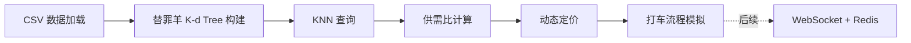

# 纽约出租车 替罪羊K-d Tree 动态计费系统

基于 K-d Tree 实现 KNN 查询，计算区域供需比，动态调整出租车费用，模拟完整打车流程。纯 C++17 项目，Clang 工具链。

## 整体架构



## 文件结构

```
C-program/
├── kd_tree.h          # K-d Tree 数据结构 + KNN
├── taxi_system.h      # 出租车系统（供需比、动态定价、打车流程）
├── csv_reader.h       # CSV 解析器（header-only）
├── main.cpp           # 主程序入口 + 测试驱动
└── data/              # Kaggle 数据集存放目录
    └── nyc_taxi.csv
```

> [!IMPORTANT]
> 所有模块使用 header-only 设计，方便后续 WebSocket 集成时直接 include 复用。

## 模块设计

---

### 模块1：替罪羊 K-d Tree + KNN

#### [NEW] [kd_tree.h](file:///c:/Users/33625/Desktop/大二下项目作业/C-program/kd_tree.h)

核心：2D K-d Tree + 替罪羊式重构保持动态平衡。

**数据结构：**
```cpp
struct Point {
    double coord[2];   // [0]=经度, [1]=纬度
    int id;            // 唯一标识（车辆ID / 乘客ID）
};

struct KdNode {
    Point point;
    KdNode* left;
    KdNode* right;
    int size;          // 子树活节点数（替罪羊核心）
    int total;         // 子树总节点数（含已删除）
    bool deleted;      // 惰性删除标记
};
```

**替罪羊平衡策略：**
- **α 参数**：`α = 0.75`（当子树 size > α × parent.size 时判定为不平衡）
- **插入后检测**：沿插入路径回溯，找到最高的不平衡节点（替罪羊），拍扁重建
- **删除策略**：惰性删除（标记 `deleted=true`），当 `已删除数 > (1-α) × total` 时触发整棵子树重建
- **重建**：中序遍历收集活节点 → 按中位数递归构建平衡 K-d Tree

**Kd_Tree 类接口：**
```cpp
class Kd_Tree {
private:
    KdNode* root;
    static constexpr double ALPHA = 0.75;

    KdNode* build_recursive(std::vector<Point>& pts, int l, int r, int depth);
    KdNode* insert_recursive(KdNode* node, const Point& p, int depth, bool& need_rebuild);
    void flatten(KdNode* node, std::vector<Point>& out);       // 拍扁收集
    KdNode* rebuild(KdNode* node, int depth);                  // 重建子树
    bool is_unbalanced(KdNode* node);                          // α-平衡判定
    void knn_search(KdNode* node, const Point& target, int k,
                    int depth, std::priority_queue<...>& pq);  // KNN 递归

public:
    void build(std::vector<Point>& points);                    // 批量构建 O(n log n)
    void insert(const Point& p);                               // 插入 + 自动重构
    void remove(int point_id);                                 // 惰性删除 + 阈值重构
    std::vector<Point> knn(const Point& target, int k);        // KNN 查询
    std::vector<Point> range_search(const Point& center, double radius_km);
};
```

**关键算法复杂度：**
| 操作 | 均摊复杂度 | 最坏复杂度 |
|------|-----------|------------|
| 构建 | O(n log n) | O(n log n) |
| 插入 | O(log n) 均摊 | O(n)（触发重建时） |
| 删除 | O(log n) | O(n)（触发重建时） |
| KNN  | O(k log n) | O(k log n) |
| 范围查询 | O(√n + k) | O(√n + k) |

**距离函数**：Haversine 公式计算地球表面两点实际距离（km）

---

### 模块2：出租车系统

#### [NEW] [taxi_system.h](file:///c:/Users/33625/Desktop/大二下项目作业/C-program/taxi_system.h)

**数据结构：**
```cpp
enum class TaxiStatus { IDLE, OCCUPIED, OFF_DUTY };

struct Taxi {
    int id;
    Point location;
    TaxiStatus status;
};

struct Passenger {
    int id;
    Point pickup;
    Point dropoff;
};

struct FareResult {
    double base_fare;       // 基础费用
    double surge_ratio;     // 供需比加价倍率
    double distance_km;     // 行程距离
    double final_fare;      // 最终费用
};
```

**TaxiSystem 类接口（预留 WebSocket 调用）：**
```cpp
class TaxiSystem {
public:
    void load_taxis(const std::vector<Taxi>& taxis);
    void load_passengers(const std::vector<Passenger>& passengers);

    // 核心算法
    double calc_supply_demand_ratio(const Point& location, double radius_km, int k);
    FareResult calc_fare(const Passenger& passenger);
    
    // 打车流程
    int request_ride(const Passenger& p);         // 返回分配的 taxi_id
    void complete_ride(int taxi_id);              // 完成行程，更新状态
    void update_taxi_location(int taxi_id, const Point& new_loc); // 位置更新
    
    // 统计信息
    void print_stats() const;
};
```

**供需比计算逻辑：**
1. 以乘客上车点为中心，用 `range_search` 找半径内所有空闲出租车（供给）
2. 用 `range_search` 找半径内所有等待中的乘客（需求）
3. `supply_demand_ratio = 供给数 / 需求数`
4. 比值 < 1 → 供不应求 → 加价；比值 > 1 → 供大于求 → 正常/降价

**动态定价公式：**
```
base_fare = 起步价 + 距离 × 每公里单价
surge_ratio = clamp(1.0 / supply_demand_ratio, 1.0, 3.0)
final_fare = base_fare × surge_ratio
```

---

### 模块3：CSV 解析

#### [NEW] [csv_reader.h](file:///c:/Users/33625/Desktop/大二下项目作业/C-program/csv_reader.h)

轻量级 CSV 解析器，用于读取 Kaggle 纽约出租车数据集：
- 解析 `pickup_longitude, pickup_latitude, dropoff_longitude, dropoff_latitude, fare_amount` 等字段
- 返回 `std::vector<Passenger>` 和模拟的 `std::vector<Taxi>`（从数据中生成）

---

### 模块4：主程序

#### [MODIFY] [main.cpp](file:///c:/Users/33625/Desktop/大二下项目作业/C-program/main.cpp)

驱动整个系统：
1. 加载 CSV → 构建 K-d Tree
2. 模拟若干次打车请求
3. 每次请求：KNN 查找 → 计算供需比 → 动态定价 → 分配车辆
4. 输出每次行程的详细信息（起终点、距离、供需比、费用）
5. 输出整体统计信息

---

## 验证计划

### 自动化测试（编译 + 运行）

在 [main.cpp](file:///c:/Users/33625/Desktop/%E5%A4%A7%E4%BA%8C%E4%B8%8B%E9%A1%B9%E7%9B%AE%E4%BD%9C%E4%B8%9A/C-program/main.cpp) 中内置测试流程，编译并运行即可验证：

```powershell
cd "c:\Users\33625\Desktop\大二下项目作业\C-program"
clang++ -std=c++17 -O2 -o taxi main.cpp && .\taxi.exe
```

**测试内容：**
1. **K-d Tree 基础测试**：用固定的 10 个点构建树，验证 nearest / knn 结果正确性
2. **Haversine 距离测试**：对比已知的纽约地标距离（如时代广场到中央公园）
3. **供需比测试**：构造已知场景（3辆车、5个乘客），验证供需计算正确
4. **动态定价测试**：验证加价倍率在 [1.0, 3.0] 范围内
5. **CSV 读取测试**：读取 Kaggle 数据集前 100 行，验证解析正确
6. **完整打车流程**：模拟 10 次打车请求，输出全流程日志

### 手动验证

请用户确认：
1. 编译无警告通过
2. 打车流程输出的费用和供需比是否符合直觉（高密度区域应加价）
3. KNN 返回的最近车辆距离是否合理
